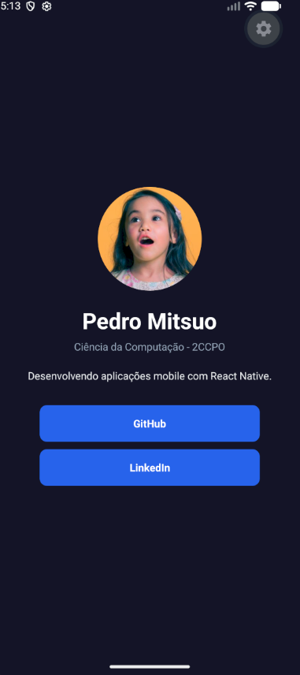
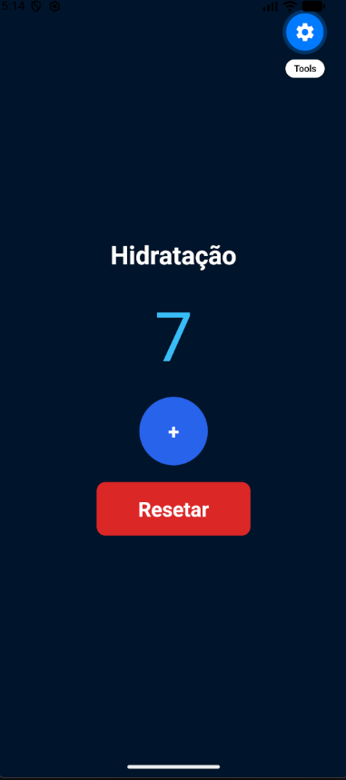
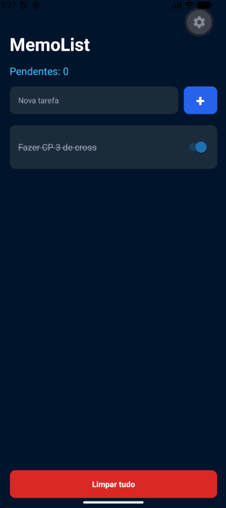
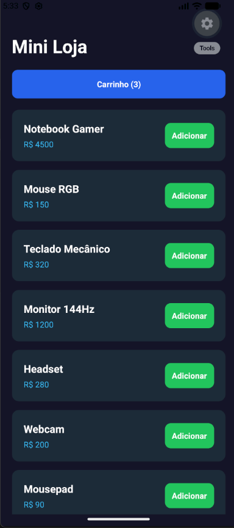
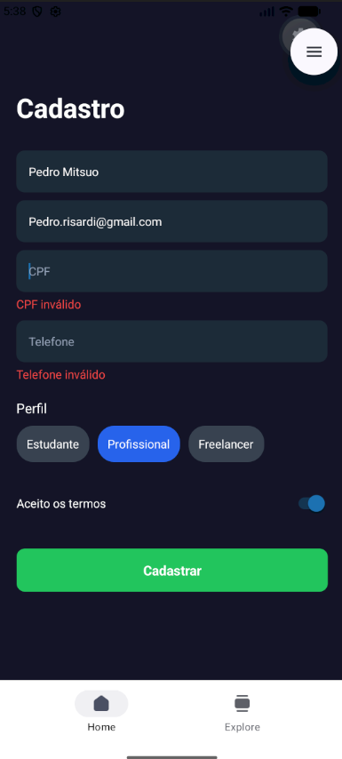

# CP3 - Cross Platform Application Development

## Identificação

- Nome: Pedro Mitsuo Risardi Nisiaymamoto
- RM: 561710
- Turma: 2CCPO
- GitHub: [Mitsuo100](https://github.com/Mitsuo100)

---

# Sobre o Projeto

Este repositório reúne todos os exercícios desenvolvidos durante a disciplina de Cross-Platform Application Development.

O objetivo do projeto é demonstrar a evolução técnica ao longo das aulas utilizando React Native e Expo, aplicando conceitos de:

- Componentização
- Hooks
- Navegação
- AsyncStorage
- Context API
- Formulários
- Validação
- UX/UI Mobile

Todos os projetos foram desenvolvidos individualmente seguindo os requisitos propostos em aula.

---

# Estrutura do Repositório

```txt
fiap-cpad-cp3
├── aula03-cartao-visita
├── aula04-contador-hidratacao
├── aula05-meu-perfil
├── aula06-memolist
├── aula07-mini-loja
├── aula09-cadastro-completo
└── README.md
```

---

# Índice de Exercícios

| Aula | Exercício | Pasta |
|------|-----------|-------|
| 03 | Cartão de Visita Digital | [aula03-cartao-visita](./aula03-cartao-visita/) |
| 04 | Contador de Hidratação | [aula04-contador-hidratacao](./aula04-contador-hidratacao/) |
| 05 | Meu Perfil | [aula05-meu-perfil](./aula05-meu-perfil/) |
| 06 | MemoList | [aula06-memolist](./aula06-memolist/) |
| 07 | Mini Loja | [aula07-mini-loja](./aula07-mini-loja/) |
| 09 | Cadastro Completo | [aula09-cadastro-completo](./aula09-cadastro-completo/) |

---

# Como Executar os Projetos

## 1. Clonar o repositório

```bash
git clone https://github.com/Mitsuo100/fiap-cpad-cp3.git
```

---

## 2. Entrar na pasta do exercício

Exemplo:

```bash
cd fiap-cpad-cp3/aula03-cartao-visita
```

---

## 3. Instalar as dependências

```bash
npm install
```

---

## 4. Executar o projeto

```bash
npx expo start
```

---

# Aula 03 — Cartão de Visita

Aplicação desenvolvida para praticar JSX, componentes core do React Native e estilização com StyleSheet.

O aplicativo apresenta informações pessoais em formato de cartão digital, contendo imagem remota, descrição pessoal e links visuais.



---

# Aula 04 — Contador de Hidratação

Aplicação desenvolvida para praticar gerenciamento de estado com useState e efeitos colaterais com useEffect.

O app realiza o controle de copos de água consumidos durante o dia, exibindo uma mensagem quando a meta diária é atingida.



---

# Aula 05 — Meu Perfil

Aplicação com múltiplas telas utilizando Expo Router para navegação.

O projeto contém uma tela inicial e uma tela de perfil com tecnologias favoritas organizadas utilizando Flexbox.


---

# Aula 06 — MemoList

Aplicação de lista de tarefas utilizando AsyncStorage para persistência local de dados.

O projeto permite adicionar tarefas, marcar tarefas como concluídas e remover todos os dados salvos.



---

# Aula 07 — Mini Loja

Aplicação de e-commerce simples utilizando Context API para gerenciamento global de estado.

O sistema possui listagem de produtos, carrinho de compras e cálculo automático do valor total dos itens adicionados.



---

# Aula 09 — Cadastro Completo

Aplicação de formulário completo com validação de campos, máscaras e feedback visual inline.

O projeto utiliza useRef para navegação entre inputs, além de loading visual durante o envio do formulário.



---

# Diferenciais Implementados

- Interface customizada em todos os exercícios
- Organização de código por pastas
- Paleta de cores personalizada
- Componentização e reutilização de lógica
- Validações visuais nos formulários
- Persistência local com AsyncStorage
- Gerenciamento global com Context API

---

# Reflexão Final

Durante o desenvolvimento deste checkpoint foi possível consolidar conhecimentos importantes do ecossistema React Native e Expo.

Os exercícios permitiram praticar conceitos fundamentais do desenvolvimento mobile, como gerenciamento de estado, persistência de dados, navegação entre telas e validação de formulários.

A evolução ao longo da disciplina contribuiu para uma melhor organização de projetos, escrita de código mais limpa e desenvolvimento de interfaces mais consistentes.

[def]: ./aula09-cadastro-completo/print.png
